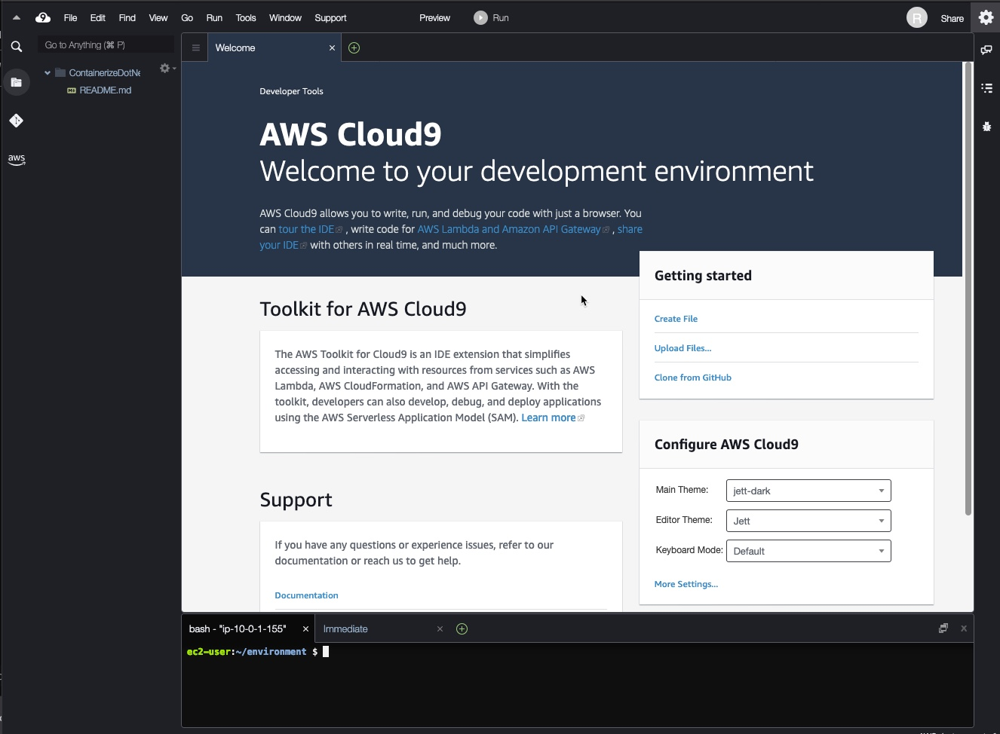

<h1 align="center"> Deploy a .NET Web Application on Amazon ECS powered by Graviton2</h1>

This repository contains a sample application code, used in demonstrating the step by step guide to deploy a .NET Application on Amazon ECS powered by Graviton2 based EC2 Instances.

Amazon Elastic Container Service ([Amazon ECS](https://aws.amazon.com/ecs/)) is a fully managed container orchestration service that helps you easily deploy, manage, and scale containerized applications.

[AWS Graviton](https://aws.amazon.com/ec2/graviton/) processors are custom built by Amazon Web Services using 64-bit Arm Neoverse cores to deliver the best price performance for your cloud workloads running in Amazon EC2. AWS Graviton2 processors deliver a major leap in performance and capabilities over first-generation AWS Graviton processors.

This guide utilizes [AWS Cloud9](https://aws.amazon.com/cloud9/) - a cloud-based integrated development environment (IDE) that lets you write, run, and debug your code with just a browser. The Cloud9 terminal provides a browser-based shell experience enabling you to install additional software, do a git push, or enter commands.

This guide is split into following sections:
* Create a Cloud9 environment with all the tools and pre-reqs using AWS CloudFormation found [here](cfn/template.yaml)
* Create a Docker image and push it to Amazon ECR (https://aws.amazon.com/ecr/)
* Create an Amazon ECS (https://aws.amazon.com/ecs)cluster 
* Deploy the application to the Amazon ECS (https://aws.amazon.com/ecs)cluster 
* Configure Monitoring and logging 

For the guide, please follow [here](https://aws.amazon.com/getting-started/hands-on/deploy-dotnet-app-ecs-gaviton).

## Table of Contents <!-- omit in toc -->

- [Architecture](#architecture)
- [Repository Structure](#repository-structure)
- [Usage](#usage)
  - [Prerequisites](#prerequisites)
  - [Code Usage](#code-usage)
- [Module 1: Setup your environment](#module-1-setup-your-environment)
  - [Set up your environment](#set-up-your-environment)
- [Module 2: Setup Cloud9 Workspace](#module-2-setup-cloud9-workspace)
  - [Open your Cloud9 IDE](#open-your-cloud9-ide)
  - [Example Cloud9 Storage](#example-cloud9-storage)
  - [Download Sample Application Code](#download-sample-application-code)
- [Module 3: Create and Publish Docker Image](#module-3-create-and-publish-docker-image)
  - [Setup Environment Variables](#setup-environment-variables)
  - [Create ECR Repository](#create-ecr-repository)
  - [Create Docker Image](#create-docker-image)
  - [Publish Docker Image](#publish-docker-image)
- [Module 4: Create Amazon ECS Cluster](#module-4-create-amazon-ecs-cluster)
  - [Enable new ECS Experience](#enable-new-ecs-experience)
  - [Create ECS Cluster](#create-ecs-cluster)
  - [Create ECS Task Definition](#create-ecs-task-definition)
- [Module 5: Deploy the Application to Amazon ECS](#module-5-deploy-the-application-to-amazon-ecs)
  - [Create ECS Service](#create-ecs-service)
- [Security](#security)
- [License](#license)

## Architecture


The architecture is composed of following building blocks:
- AWS Cloud9 environment facilitating creation of docker image, publication of image to Amazon ECR Repository
- Amazon ECS Cluster with an [AWS Application Load Balancer](https://docs.aws.amazon.com/elasticloadbalancing/latest/application/introduction.html) to balance the requests among the tasks launched by Amazon ECS Service
- Database layer, powered by [Amazon Aurora MySQL](https://aws.amazon.com/rds/aurora/)
- [Amazon Secrets Manager](https://aws.amazon.com/secrets-manager/) to securely store the database credentials, to be used by the sample application
- [Amazon CloudWatch](https://aws.amazon.com/cloudwatch/) to enable logging and monitoring of the sample application deployed in Amazon ECS Cluster.

## Repository Structure
- [`app`](/app/) directory contains the sample application code
- [`cfn`](/cfn/) directory contains the CloudFormation template used to initialize the Cloud9 environment with sample application database
- [`docs`](/docs/) directory contains the images and files associated with this documentation
- [`Code of Conduct`](CODE_OF_CONDUCT.md) file refers to Amazon Source Code - Code of Conduct guidelines
- [`License`](LICENSE) file refers to license terms for the use of this repository and content
- [`README`](README.md) file refers to this page.

## Usage

### Prerequisites

Before you begin, be sure that you have a registered AWS Account and logged in with an IAM user with permissions specified in the AdministratorAccess. You can follow the steps illustrated [here](https://docs.aws.amazon.com/AmazonECS/latest/developerguide/get-set-up-for-amazon-ecs.html). 
You're not required to follow steps other than **Sign up for AWS** and **Create an IAM user**.


### Code Usage

This is a sample application, only to be used for demonstration of deploying a .Net application on Graviton2 instances behind Amazon ECS.

The getting started guide instructions will illustrate how to clone this repository into a Cloud9 environment, and create a Docker image, for deployment into ECS.

## Module 1: Setup your environment

### Set up your environment

1. Deploy the latest CloudFormation template by following the link below for your preferred AWS region:

|Region|Launch Template|
|------|---------------|
|**US East (N. Virginia)** (us-east-1) | [](https://console.aws.amazon.com/cloudformation/home?region=us-east-1#/stacks/new?stackName=LookoutVisionApp&templateURL=https://containerize-dotnet-app-on-ecs-graviton2-assets.s3-us-west-2.amazonaws.com/containerize_dotnet_app_ecs_graviton2.yml)|
|**US East (Ohio)** (us-east-2) | [](https://console.aws.amazon.com/cloudformation/home?region=us-east-2#/stacks/new?stackName=LookoutVisionApp&templateURL=https://containerize-dotnet-app-on-ecs-graviton2-assets.s3-us-west-2.amazonaws.com/containerize_dotnet_app_ecs_graviton2.yml)|
|**US West (Oregon)** (us-west-2) | [](https://console.aws.amazon.com/cloudformation/home?region=us-west-2#/stacks/new?stackName=LookoutVisionApp&templateURL=https://containerize-dotnet-app-on-ecs-graviton2-assets.s3-us-west-2.amazonaws.com/containerize_dotnet_app_ecs_graviton2.yml)|
|**EU (Ireland)** (eu-west-1) | [](https://console.aws.amazon.com/cloudformation/home?region=eu-west-1#/stacks/new?stackName=LookoutVisionApp&templateURL=https://containerize-dotnet-app-on-ecs-graviton2-assets.s3-us-west-2.amazonaws.com/containerize_dotnet_app_ecs_graviton2.yml)|

This should take you to AWS CloudFormation Service - Create Stack screen.

2. On the Create Stack - Step 1: Specify template screen, confirm that the URL https://containerize-dotnet-app-on-ecs-graviton2-assets.s3-us-west-2.amazonaws.com/containerize_dotnet_app_ecs_graviton2.yml is entered in the Amazon S3 URL field and press Next button. 
   

3. On the Step 2 - Specify stack details screen, you can specify the stack name, network configuration, as well as Amazon RDS configuration. All required fields are already pre-filled with the default values You can either leave them as default and press Next button.


4. On the Step 3 - Configure stack options screen - leave the defaults, and don’t make any changes, just press Next button.

5. On the Step 4 - Review screen, scroll to the bottom of the page and check all checkboxes, as per the screenshot below, then press Create stack for the template to be deployed.


6. When the template is in the CREATE_COMPLETE you can find information about created environment by going to AWS Console -> CloudFormation, selecting the created stack and going to the Outputs tab. You will see information like on the screenshot below.

Copy the values and paste them into a notepad, or local text file for easy reference in the later instructions.


## Module 2: Setup Cloud9 Workspace

Now that you have configured an AWS Cloud9 environment into our account. we want to setup our Cloud9 workspace and download the sample application’s source code into our environment.

### Open your Cloud9 IDE

1. You can launch and navigate to your Cloud9 workspace by clicking on Cloud9 IDE URL shown in your CloudFormation stack outputs. 

Then you should have an IDE environment as shown below:


1. In Cloud9 open a new **Terminal** window using Top Navigation Window Menu, select New Terminal, it should open a new Terminal window. Keep your AWS Cloud9 IDE opened in a tab as you’ll be using it for future steps.

### Example Cloud9 Storage

In order to accommodate dependencies, the underlying drive has already been expanded and we only need to increase the partition size. So on the terminal window run following 2 commands:
```
sudo growpart /dev/xvda 1
sudo resize2fs /dev/xvda1
```

### Download Sample Application Code
Download the sample application source code (from this repository) to your AWS Cloud9 IDE environment by running the following command in the Cloud9 terminal window:

`git clone https://github.com/aws-samples/amazon-ecs-dotnet-app-graviton`

   
## Module 3: Create and Publish Docker Image
In previous modules, we launched an AWS CloudFormation stack, which created a new AWS VPC, Public and Private subnet pairs in 2 Availability Zones, 1 AWS RDS Aurora instance in a Private subnet, and also initialized an AWS Cloud9 environment to issue AWS Command Line Interface(CLI) commands via command line.

We also cloned a sample .NET application from Github on the Cloud9 Bash Terminal, and built a .NET package. 
This module gives step by step instructions for the Build and Publish stage of Sample Application.

### Setup Environment Variables

1. Open the AWS Cloud9 new terminal window, following the instruction listed in Module2
   
2. Configure the AWS CLI with our current region as default (you can retrieve the region you chose from instance metadata)

```
export AWS_REGION=$(curl -s http://169.254.169.254/latest/meta-data/placement/region)
aws configure set default.region ${AWS_REGION}
aws configure get default.region
```

3. Set up env variable for AWS account id, for later reuse

```
export AWS_ACCOUNT_ID=$(aws sts get-caller-identity --query Account --output text)
echo $AWS_ACCOUNT_ID
```

In subsequent steps we will be referring these values, so storing them in the environment variables takes away the need of copy pasting the values, or writing long command line instructions.

### Create ECR Repository

Create an Amazon ECR repository to store movie-app image, and note the Repo URI in the output. The output is also stored in an env variable called IMAGE_REPO_URI, using our utility function save_var. You can choose any name for your repository, in the example here, we chose movie-app-repo.

```
export IMAGE_REPO_URI=$( \
aws ecr create-repository \
--repository-name movie-app-repo \
--query repository.repositoryUri \
--output text \
)
echo Repo URI: $IMAGE_REPO_URI
```

The result should look something like this:


Keep this information on a separate notepad as we’ll need this image repository URI when we specify container definition in our Amazon ECS Task Definition.

### Create Docker Image

In this step we’ll create a Dockerfile and then build a docker image for our sample application.

1. Move to the source code directory
 ``` 
 cd ~/environment/amazon-ecs-dotnet-app-graviton/app/ 
 ```
2. Create Dockerfile in the root of the project
 ```
 touch Dockerfile
 ```

3. Open Dockerfile either in Cloud9 IDE or via command-line text editor such as nano or vi, and the commands listed below. Each command has an inline documentation below to explain the purpose of the command.

 ```
 FROM mcr.microsoft.com/dotnet/sdk:5.0 AS build
 WORKDIR /src

 # These lines copy MvcMovie.csproj project files in the current directory 
 # and then restore for the specified runtime, using -r.
 COPY ["MvcMovie.csproj", "./"]
 RUN dotnet restore "MvcMovie.csproj" -r linux-musl-arm64

 # Build dotnet project and publishes the application and its dependencies to a folder for deployment to a hosting system.
 COPY . .
 WORKDIR "/src/."
 RUN dotnet publish "MvcMovie.csproj" -c Release -o /app/publish -r linux-musl-arm64 --self-contained false --no-restore


 # Docker build command
 # You need to use an architecture-specific tag if you want to target ARM based instances. 
 # Note that .NET is only supported on Alpine on ARM64 and x64, and not ARM32.
 FROM mcr.microsoft.com/dotnet/aspnet:5.0-alpine-arm64v8
 WORKDIR /app
 EXPOSE 80
 COPY --from=build /app/publish .
 ENTRYPOINT ["dotnet", "MvcMovie.dll"]
 ```

4. Build and publish docker image with tag movie-app. Tag your image with the Amazon ECR registry, repository, and optional image tag name combination to use. For detail you can refer here later. The commands below can take a few minutes.

 ```
 docker build -t movie-app .
 docker tag movie-app $IMAGE_REPO_URI
 ```

 5. Confirm the image is created successfully

 ```
 docker images movie-app
 ```

 The command line outputs should look something like below:
 

### Publish Docker Image

In this step we’ll login to our Amazon ECR Repository, and then publish the new image we built in the last step.

1. To be able to push the image to the Amazon ECR, we’ll login into the default private Amazon Elastic Container Registry. The URL for your default private registry (replacing the values from environment variables we created earlier) is: https://$AWS_ACCOUNT_ID.dkr.ecr.$AWS_REGION.amazonaws.com

```
aws ecr get-login-password | docker login --username AWS --password-stdin $AWS_ACCOUNT_ID.dkr.ecr.$AWS_REGION.amazonaws.com
```

2. Finally we’ll push the docker container we created to the repository, via following command.

```
docker push $IMAGE_REPO_URI
aws ecr describe-images --repository-name movie-app-repo
```

Output should look like this


## Module 4: Create Amazon ECS Cluster
In previous modules, we created a Graviton2 Build Platform, created and published a Docker container into an Amazon ECR Repository. In this module, we’ll deploy the newly published container into Amazon Elastic Container Service (ECS).

### Enable new ECS Experience
From the AWS Management Console go to Amazon Elastic Container Service, either via search function or from the Services drop down button, and looking under the category - Containers.

The screenshots in this section may look different for those using old ECS Experience, ensure that where applicable, in left hand navigation pane New ECS Experience is enabled. If navigation pane is not visible, for some services, it may require clicking the hamburger button, to expand the navigation pane.


### Create ECS Cluster
In this step we’ll create a new ECS Cluster. 

1. Click on Clusters menu in the navigation pane, and click on Create Cluster button.

2. In **Step 1: Select cluster template**, choose **EC2 Linux + Networking.....** option and click **Next step** button


3. In **Step 2 : Configure cluster**, use following values for the specified labels, and leave the rest default.
   
**Cluster name**: Graviton2ECSCluster

**EC2 Instance type**: t4g.medium

**Number of instances**: 1


4. In the **Networking** section, enter following values for the specified labels:

**VPC**: select **TargetVPC** from the dropdown

**Subnets**: select 2 private subnets **TargetVPC-private-a-web** and **TargetVPC-private-b-web**, one after another

**Security Group**: select **ECSServiceSG** from the dropdown. You can click on the Security group selected to see the inbound and outbound rules. 


5. Leave rest of the settings as default, which means:

- **Container instance IAM role**: a new IAM role will be created which allows the instances provisioned to be able to access other AWS services.

- Ensure the **Enable Container Insights** Checkbox is ticked.


6. Now click **Create** button, on the next screen it should show you the progress of the cluster being created. Once successful, click **View Cluster** to see the details.


At this stage, we have an ECS Cluster created, with private subnets, however we don’t have any service/tasks running. For that we need to create a [Task Definition](https://docs.aws.amazon.com/AmazonECS/latest/developerguide/task_definitions.html).


### Create ECS Task Definition

1. Under the left hand side navigation pane on Amazon ECS page, you'll find an option for Task Definitions, click **Create new Task Definition**. This is the stage where we'll specify the details of the container to be deployed, CPU and memory requirements, for simplicity, we'll keep the changes to minimum. So leave the options default, unless specified.

2. In **Step 1: Select launch type compatibility**, Select EC2 for Launch type compatibility, hit **Next step**


3. In Step 2: Configure task and container definitions, enter following values for the specified labels:

- **Task Definition Name**: Graviton2ECSTask
- **Task Role**: None
- **Task execution IAM role**: choose the role available in the dropdown - -ECSTaskExecutionRole. If you used the name suggested in Module 2 above, it should start with ContainerizeDotNetOnECSGraviton2-ECSTaskExecutionRole, this allows tasks to pull container images and publish container logs to Amazon CloudWatch on your behalf, as well as enables it to read secrets from AWS Secrets manager.
- **Task memory (MiB)**: 512
- **Task CPU (unit)**: 1024

It should look like below


4. Next step is to define the container to be used, click **Add Container** under **Container Definitions**, it should open a new window, then enter following values for the specified labels:

- **Container name**: Graviton2Container
- **Image**: paste the IMAGE_REPO_URI, that you copied earlier from Cloud9 console, make sure it ends with the tag: latest, unless you used a specific tag. It should be <AWS_ACCOUNT_ID>.dkr.ecr.<AWS_REGION>.amazonaws.com/movie-app-repo:latest
- **Port mapping**: 0, 80 i.e. container to make port accessible for the underlying host port 80. Note: When you omit the Host Port (or set it to 0) while specifying a Container Port and your container automatically receives a port in the ephemeral port range for your container instance operating system and Docker version.


5. Next we have to add environment variables for the container to be able to access the Database instance deployed by the CloudFormation template in Module 1. 

Also refer the value of the key **RDSSecretARN**, we copy pasted for later reference in the Module 2. We’ll need it now.

In the **Environment Section** section under **Environment variables**, Add following environment variables. 

Note: Where applicable values end with double colon symbols (::).

|Key|Value/valueFrom|value |
|------|---------------|-----|
|DBHOST|	ValueFrom|	`<RDSSecretARN from CloudFormation Outputs>:host::`|
|DBNAME|	ValueFrom|	`<RDSSecretARN from CloudFormation Outputs>:dbname::`|
|DBUSER|	ValueFrom|	`<RDSSecretARN from CloudFormation Outputs>:username::`|
|DBPASS|	ValueFrom|	`<RDSSecretARN from CloudFormation Outputs>:password::`|
|DBSSLMODE|	Value|	`none`|

- **Key**: name of the env variable for your application, e.g. DBHOST
- **Value/ValueFrom** dropdown value: value for hard coded values, and ValueFrom for the values retrieved from AWS Systems manager Parameter Store/AWS Secrets Manager. 
- **Value**: In our Guide, we’re using AWS Secrets manager to store database credentials securely, so the value will be in the format as arn:aws:secretsmanager:region:<aws_account_id>:secret:secret-name:json-key:version-stage:version-id specified by the ECS documentation [here](https://docs.aws.amazon.com/AmazonECS/latest/developerguide/specifying-sensitive-data-secrets.html).


6. Under **STORAGE AND LOGGING** section select checkbox for **Log Configuration - Auto-configure CloudWatch Logs**, as below:


Leave rest of the settings as is and press Add button at the bottom of the screen.

7. Back on the Task Definitions page, you should see the container definition, just created. Hit Create button to create the Task definition.


8. Click on **Clusters** in the left side navigation pane, and then click on **Graviton2ECSCluster** from the list of Clusters.


Review the Service and Tasks and you’ll see no records. This means that although our Task Definition is complete but no Tasks are running, so in the next section we’ll create Amazon ECS Service, which will launch a [Load balanced Amazon ECS Service](https://docs.aws.amazon.com/AmazonECS/latest/userguide/service-load-balancing.html) and runs tasks using the task definition we created in this module.

## Module 5: Deploy the Application to Amazon ECS
So far in the guide we have prepared the foundational environment for our sample application in Module 1 and Module 2. In Module 3 we built and published the Docker image for the sample application, and in Module 4 we created the building blocks required to launch a Load Balanced [Amazon ECS Service](https://docs.aws.amazon.com/AmazonECS/latest/developerguide/ecs_services.html) that will instantiate tasks behind the AWS Application Load Balancer.

### Create ECS Service

1. Select the Cluster - **Graviton2ECSCluster**


## Security

See [CONTRIBUTING](CONTRIBUTING.md#security-issue-notifications) for more information.

## License

This library is licensed under the MIT-0 License. See the LICENSE file.

