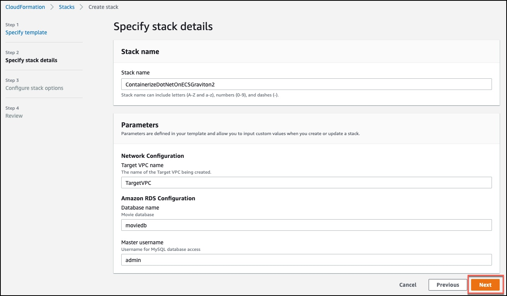
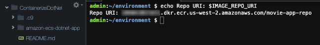
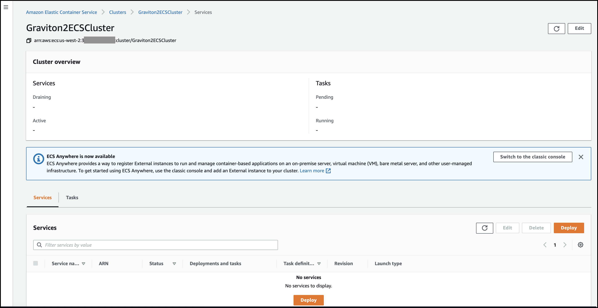
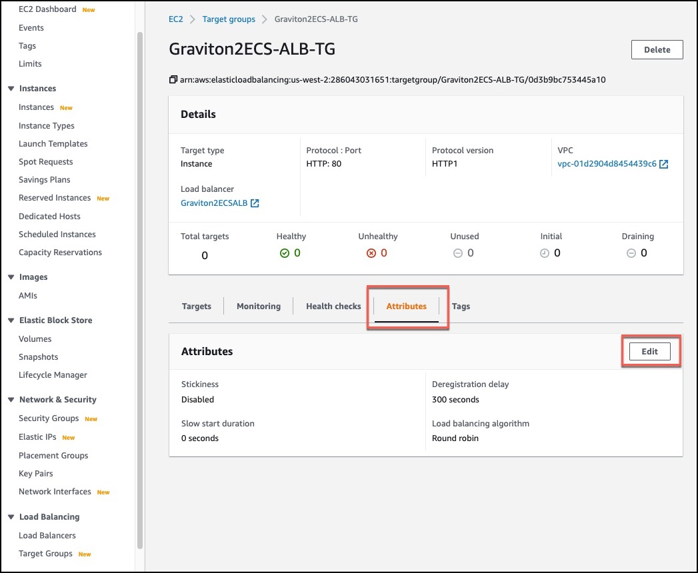

[](https://github.com/aws-samples/amazon-ecs-dotnet-app-graviton/actions)
[](https://github.com/aws-samples/amazon-ecs-dotnet-app-graviton/actions)

<h1 align="center"> Deploy a .NET Web Application on Amazon ECS powered by Graviton2</h1>

This repository contains a sample application code, used in demonstrating the step-by-step guide to deploy a .NET Application on Amazon ECS powered by Graviton2 based EC2 Instances.

Amazon Elastic Container Service ([Amazon ECS](https://aws.amazon.com/ecs/)) is a fully managed container orchestration service that helps you easily deploy, manage, and scale containerized applications.

[AWS Graviton](https://aws.amazon.com/ec2/graviton/) processors are custom-built by Amazon Web Services using 64-bit Arm Neoverse cores to deliver the best price performance for your cloud workloads running in Amazon EC2. AWS Graviton2 processors deliver a major leap in performance and capabilities over first-generation AWS Graviton processors.

This guide utilizes [AWS Cloud9](https://aws.amazon.com/cloud9/) - a cloud-based integrated development environment (IDE) that lets you write, run, and debug your code with just a browser. The Cloud9 terminal provides a browser-based shell experience enabling you to install additional software, do a git push, or enter commands.

This guide is split into following sections:

- Create an [AWS Cloud9](https://aws.amazon.com/cloud9/) environment with all tools and prerequisites using [AWS CloudFormation](https://aws.amazon.com/cloudformation/).
- Create a Docker image and push it to [Amazon ECR](https://aws.amazon.com/ecr/).
- Create an [Amazon ECS Cluster](https://docs.aws.amazon.com/AmazonECS/latest/developerguide/clusters.html).
- Deploy the application to the Amazon ECS Cluster.
- Configure Monitoring and logging.

For the guide, please follow [here](https://aws.amazon.com/getting-started/hands-on/deploy-dotnet-web-app-ecs-graviton/).

## Table of Contents <!-- omit in toc -->

- [Architecture](#architecture)
- [Repository Structure](#repository-structure)
- [Usage](#usage)
  - [Prerequisites](#prerequisites)
  - [Code Usage](#code-usage)
- [Module 1: Setup your environment](#module-1-setup-your-environment)
  - [Setup your environment](#setup-your-environment)
- [Module 2: Setup Cloud9 Workspace](#module-2-setup-cloud9-workspace)
  - [Open your Cloud9 IDE](#open-your-cloud9-ide)
  - [Expand Cloud9 Storage](#expand-cloud9-storage)
  - [Download Sample Application Code](#download-sample-application-code)
- [Module 3: Create and Publish Docker Image](#module-3-create-and-publish-docker-image)
  - [Setup Environment Variables](#setup-environment-variables)
  - [Create ECR Repository](#create-ecr-repository)
  - [Create Docker Image](#create-docker-image)
  - [Publish Docker Image](#publish-docker-image)
- [Module 4: Create Amazon ECS Cluster](#module-4-create-amazon-ecs-cluster)
  - [Enable new ECS Experience](#enable-new-ecs-experience)
  - [Create ECS Cluster](#create-ecs-cluster)
  - [Create ECS Task Definition](#create-ecs-task-definition)
- [Module 5: Deploy the Application to Amazon ECS](#module-5-deploy-the-application-to-amazon-ecs)
  - [Create ECS Service](#create-ecs-service)
  - [Setup Load Balancing](#setup-load-balancing)
  - [Define Network Boundaries](#define-network-boundaries)
  - [Enable Session Management for Sample Application](#enable-session-management-for-sample-application)
  - [Test the deployment](#test-the-deployment)
- [Module 6: Monitoring and Logging](#module-6-monitoring-and-logging)
  - [Confirm Container Insights is Enabled](#confirm-container-insights-is-enabled)
  - [Visualising Container Insights in CloudWatch](#visualising-container-insights-in-cloudwatch)
  - [Analysing Application Logs via CloudWatch](#analysing-application-logs-via-cloudwatch)
- [Module 7: Clean Up](#module-7-clean-up)
  - [Delete ECS Service](#delete-ecs-service)
  - [Delete Load Balancer](#delete-load-balancer)
  - [Delete Target Group](#delete-target-group)
  - [Delete Task Definition](#delete-task-definition)
  - [Delete ECS Cluster](#delete-ecs-cluster)
  - [Delete ECR Repository](#delete-ecr-repository)
  - [Delete CloudFormation Stack](#delete-cloudformation-stack)
- [Security](#security)
- [LICENSE](#license)

## Architecture


The architecture is composed of following building blocks:

- AWS Cloud9 environment facilitating creation of docker image, publication of image to Amazon ECR Repository.
- Amazon ECS Cluster with an [Application Load Balancer](https://docs.aws.amazon.com/elasticloadbalancing/latest/application/introduction.html) to balance the requests among the tasks launched by Amazon ECS Service.
- Database layer, powered by [Amazon Aurora MySQL](https://aws.amazon.com/rds/aurora/).
- [Amazon Secrets Manager](https://aws.amazon.com/secrets-manager/) to securely store the database credentials, to be used by the sample application.
- [Amazon CloudWatch](https://aws.amazon.com/cloudwatch/) to enable logging and monitoring of the sample application deployed in Amazon ECS Cluster.

## Repository Structure

- [`app`](app) directory contains the sample application code.
- [`cfn`](cfn) directory contains the CloudFormation template used to initialize the Cloud9 environment with sample application database.
- [`docs`](docs) directory contains the images and files associated with this documentation including "Local Development" guide.
- [`Code of Conduct`](CODE_OF_CONDUCT.md) file refers to Amazon Source Code - Code of Conduct guidelines.
- [`License`](LICENSE) file refers to license terms for the use of this repository and content.
- [`README`](README.md) file refers to this page.

## Usage

### Prerequisites

Before you begin, be sure that you have a registered AWS Account and logged in with an IAM user with permissions specified in the AdministratorAccess. You can follow the steps illustrated [here](https://docs.aws.amazon.com/AmazonECS/latest/developerguide/get-set-up-for-amazon-ecs.html).
You're not required to follow steps other than **Sign up for AWS** and **Create an IAM user**.

### Code Usage

This is a sample application, only to be used for demonstration of deploying a .Net application on Graviton2 instances behind Amazon ECS.

The getting started guide instructions will illustrate how to clone this repository into a Cloud9 environment, and create a Docker image, for deployment into ECS.

## Module 1: Setup your environment

### Setup your environment

1. Deploy the latest CloudFormation template by following the link below for your preferred AWS region:

|Region|Launch Template|
|------|---------------|
|**US East (N. Virginia)** (us-east-1)|[](https://console.aws.amazon.com/cloudformation/home?region=us-east-1#/stacks/new?stackName=ContainerizeDotNetOnECSGraviton2&templateURL=https://s3.amazonaws.com/solution-builders-us-east-1/amazon-ecs-dotnet-app-graviton/latest/main.template)|
|**US East (Ohio)** (us-east-2)|[](https://console.aws.amazon.com/cloudformation/home?region=us-east-2#/stacks/new?stackName=ContainerizeDotNetOnECSGraviton2&templateURL=https://s3.amazonaws.com/solution-builders-us-east-2/amazon-ecs-dotnet-app-graviton/latest/main.template)|
|**US West (Oregon)** (us-west-2)|[](https://console.aws.amazon.com/cloudformation/home?region=us-west-2#/stacks/new?stackName=ContainerizeDotNetOnECSGraviton2&templateURL=https://s3.amazonaws.com/solution-builders-us-west-2/amazon-ecs-dotnet-app-graviton/latest/main.template)|
|**EU (Ireland)** (eu-west-1)|[](https://console.aws.amazon.com/cloudformation/home?region=eu-west-1#/stacks/new?stackName=ContainerizeDotNetOnECSGraviton2&templateURL=https://s3.amazonaws.com/solution-builders-eu-west-1/amazon-ecs-dotnet-app-graviton/latest/main.template)|
|**EU (Frankfurt)** (eu-central-1)|[](https://console.aws.amazon.com/cloudformation/home?region=eu-central-1#/stacks/new?stackName=ContainerizeDotNetOnECSGraviton2&templateURL=https://s3.amazonaws.com/solution-builders-eu-central-1/amazon-ecs-dotnet-app-graviton/latest/main.template)|
|**AP (Sydney)** (ap-southeast-2)|[](https://console.aws.amazon.com/cloudformation/home?region=ap-southeast-2#/stacks/new?stackName=ContainerizeDotNetOnECSGraviton2&templateURL=https://s3.amazonaws.com/solution-builders-ap-southeast-2/amazon-ecs-dotnet-app-graviton/latest/main.template)|

This should take you to AWS CloudFormation Service - Create Stack screen.

2. If prompted, login using your AWS account credentials.
3. You should see a screen titled "*Create Stack*" at the "*Specify template*" step. The fields specifying the CloudFormation
   template are pre-populated. Click the *Next* button at the bottom of the page.

4. On the Step 2 - Specify stack details screen, you can specify the stack name, network configuration, as well as Amazon RDS configuration. All required fields are already pre-filled with the default values. You can leave them as defaults and press Next button.



5. On the Step 3 - Configure stack options screen - leave the defaults, and don’t make any changes, just press Next button.

6. On the Step 4 - Review screen, scroll to the bottom of the page and check all checkboxes, as per the screenshot below, then press Create stack for the template to be deployed.
   

7. When the template is in the CREATE_COMPLETE state, you can find information about created environment by going to AWS Console -> CloudFormation, selecting the created stack and going to the Outputs tab. You will see information like on the screenshot below.
   
   Copy the values and paste them into a notepad, or local text file for easy reference in the later instructions.

## Module 2: Setup Cloud9 Workspace

Now that you have configured an AWS Cloud9 environment into your account, you will set up your Cloud9 workspace and download the sample application’s source code into your environment.

### Open your Cloud9 IDE

1. You can launch and navigate to your Cloud9 workspace by clicking on Cloud9 IDE URL shown in your CloudFormation stack outputs.
   
   Then you should see an IDE window, as shown below:
   

2. In Cloud9 open a new **Terminal** window using Top Navigation Window Menu, select New Terminal, it should open a new Terminal window. Keep your AWS Cloud9 IDE opened in a tab, as you’ll be using it for most activities.

### Expand Cloud9 Storage

Sample application has package dependencies that need more space than what is initially allocated with Cloud9. So the CloudFormation template has instructions to expand the storage, as per the guidance [here](https://docs.aws.amazon.com/cloud9/latest/user-guide/move-environment.html#move-environment-resize). You only need to increase the partition size, using following two commands:

```
sudo growpart /dev/xvda 1
sudo resize2fs /dev/xvda1
```

### Download Sample Application Code

Download the sample application source code (from this repository) to your AWS Cloud9 IDE environment by running the following command in the Cloud9 terminal window:

`git clone https://github.com/aws-samples/amazon-ecs-dotnet-app-graviton`

## Module 3: Create and Publish Docker Image

In previous modules, you launched an AWS CloudFormation stack, which created a new AWS VPC, Public and Private subnet pairs in 2 Availability Zones, 1 AWS RDS Aurora instance in a Private subnet, and also initialized an AWS Cloud9 environment to issue AWS Command Line Interface(CLI) commands via command line.

You also cloned a sample .NET application from GitHub on the Cloud9 Bash Terminal, and built a .NET package.
This module gives step-by-step instructions for the Build and Publish stage of Sample Application.

### Setup Environment Variables

1. Open the new AWS Cloud9 terminal window as per the instructions listed in Module 2.

2. Configure the AWS CLI with your current region as default (you can retrieve the region you chose from [instance metadata](https://docs.aws.amazon.com/AWSEC2/latest/UserGuide/instancedata-data-retrieval.html#instance-metadata-ex-2)).

```
export AWS_REGION=$(curl -s http://169.254.169.254/latest/meta-data/placement/region)
aws configure set default.region ${AWS_REGION}
aws configure get default.region
```

3. Set up env variable for AWS account id, for later reuse.

```
export AWS_ACCOUNT_ID=$(aws sts get-caller-identity --query Account --output text)
echo $AWS_ACCOUNT_ID
```

In subsequent steps you will be referring these values, so storing them in the environment variables takes away the need of copying and pasting the values, or writing long command line instructions.

### Create ECR Repository

Create an Amazon ECR repository to store movie-app docker image, set up environment variable for the Repo URI, and note the Repo URI in the output. You can choose any name for your repository, this guide suggests using name as movie-app-repo.

```
export IMAGE_REPO_URI=$( \
aws ecr create-repository \
--repository-name movie-app-repo \
--query repository.repositoryUri \
--output text \
)
echo Repo URI: $IMAGE_REPO_URI
```

The result should look something like this:



Keep this information on a separate notepad as you'll need this image repository URI when you specify container definition in your Amazon ECS Task Definition.

### Create Docker Image

In this step you'll create a Dockerfile and then build a docker image for your sample application.

1. Move to the source code directory

```
cd ~/environment/amazon-ecs-dotnet-app-graviton/app/
```

2. Create Dockerfile in the root of the project

```
touch Dockerfile
```

3. Open Dockerfile, either in Cloud9 IDE or via command-line text editor such as nano or vi, then copy the commands listed below and paste them into the file, and then save the file. Each command has an inline documentation to explain the purpose of the command.

```
FROM mcr.microsoft.com/dotnet/sdk:5.0 AS build
WORKDIR /src

# These lines copy MvcMovie.csproj project files in the current directory
# and then restore for the specified runtime, using -r.
COPY ["MvcMovie.csproj", "./"]
RUN dotnet restore "MvcMovie.csproj" -r linux-musl-arm64

# Build dotnet project and publishes the application and its dependencies to a folder for deployment to a hosting system.
COPY . .
WORKDIR "/src/."
RUN dotnet publish "MvcMovie.csproj" -c Release -o /app/publish -r linux-musl-arm64 --self-contained false --no-restore


# Docker build command
# You need to use an architecture-specific tag if you want to target ARM based instances.
# Note that .NET is only supported on Alpine on ARM64 and x64, and not ARM32.
FROM mcr.microsoft.com/dotnet/aspnet:5.0-alpine-arm64v8
WORKDIR /app
EXPOSE 80
COPY --from=build /app/publish .
ENTRYPOINT ["dotnet", "MvcMovie.dll"]
```

4. Build and publish docker image with tag movie-app. Tag your image with the Amazon ECR registry, repository, and optional image tag name combination to use. For detail, you can refer here later. The commands below can take a few minutes.

```
docker build -t movie-app .
docker tag movie-app $IMAGE_REPO_URI
```

5.  Confirm the image is created successfully

```
docker images movie-app
```

The command line outputs should look something like below:


### Publish Docker Image

In this step you'll login to your Amazon ECR Repository, and then publish the new image you built in the last step.

1. To be able to push the docker image to the Amazon ECR, you’ll login into the default private Amazon Elastic Container Registry. The URL for your default private registry (replacing the values from environment variables you created earlier) is: https://$AWS_ACCOUNT_ID.dkr.ecr.$AWS_REGION.amazonaws.com.

```
aws ecr get-login-password | docker login --username AWS --password-stdin $AWS_ACCOUNT_ID.dkr.ecr.$AWS_REGION.amazonaws.com
```

2. Finally, you’ll push the docker image you created, to the repository, via following command.

```
docker push $IMAGE_REPO_URI
aws ecr describe-images --repository-name movie-app-repo
```

Output should look like this:


## Module 4: Create Amazon ECS Cluster

In previous modules, you created a Graviton2 Build Platform, created and published a Docker container into an Amazon ECR Repository. In this module, you'll deploy the newly published container into Amazon Elastic Container Service (ECS).

### Enable new ECS Experience

From the AWS Management Console go to Amazon Elastic Container Service, either via search function or from the Services drop down button, and looking under the category - Containers.

The screenshots in this section may look different for those using old ECS Experience, ensure that where applicable, in left hand navigation pane New ECS Experience is enabled. If navigation pane is not visible for some services, it may require clicking the hamburger button, to expand the navigation pane.


### Create ECS Cluster

In this step, you'll create a new ECS Cluster.

1. Click on Clusters menu in the navigation pane, and click on Create Cluster button.

2. In **Step 1: Select cluster template**, choose **EC2 Linux + Networking.....** option and click **Next step** button
   

3. In **Step 2 : Configure cluster**, use following values for the specified labels, and leave the rest with default values.

**Cluster name**: Graviton2ECSCluster

**EC2 Instance type**: t4g.medium

**Number of instances**: 1


4. In the **Networking** section, enter following values for the specified labels:

**VPC**: select **TargetVPC** from the dropdown

**Subnets**: select 2 private subnets **TargetVPC-private-a-web** and **TargetVPC-private-b-web**, one after another

**Security Group**: select **ECSServiceSG** from the dropdown. You can click on the Security group selected to see the inbound and outbound rules.


5. Leave rest of the settings as default, which means:

- **Container instance IAM role**: a new IAM role will be created which allows the instances provisioned to be able to access other AWS services.

- Ensure the **Enable Container Insights** Checkbox is ticked.


6. Now click **Create** button, on the next screen it should show you the progress of the cluster being created. Once successful, click **View Cluster** to see the details.


At this stage, you have an ECS Cluster created, with private subnets, however you don’t have any service/tasks running. For that you need to create a [Task Definition](https://docs.aws.amazon.com/AmazonECS/latest/developerguide/task_definitions.html).

### Create ECS Task Definition

1. Under the left hand side navigation pane on Amazon ECS page, you'll find an option for Task Definitions, click **Create new Task Definition**. This is the stage where you will specify the details of the container to be deployed, CPU and memory requirements, for simplicity, you will keep the changes to minimum. So leave the options default, unless specified.

2. In **Step 1: Select launch type compatibility**, Select EC2 for Launch type compatibility, hit **Next step**


3. In Step 2: Configure task and container definitions, enter following values for the specified labels:

- **Task Definition Name**: Graviton2ECSTask
- **Task Role**: None
- **Task execution IAM role**: choose the role available in the dropdown - <CloudFormation-Stack-Name>-ECSTaskExecutionRole. If you used the name suggested in Module 1, it should start with ContainerizeDotNetOnECSGraviton2-ECSTaskExecutionRole. This allows tasks to pull container images and publish container logs to Amazon CloudWatch on your behalf, as well as enables it to read secrets from AWS Secrets manager.
- **Task memory (MiB)**: 512
- **Task CPU (unit)**: 1024

It should look like below


4. Next step is to define the container to be used, click **Add Container** under **Container Definitions**, it should open a new window, then enter following values for the specified labels:

- **Container name**: Graviton2Container
- **Image**: paste the IMAGE_REPO_URI, that you copied earlier from Cloud9 console, make sure it ends with the tag: latest, unless you used a specific tag. It should be <AWS_ACCOUNT_ID>.dkr.ecr.<AWS_REGION>.amazonaws.com/movie-app-repo:latest
- **Port mapping**: 0, 80 i.e. container to make port accessible for the underlying host port 80. Note: When you omit the Host Port (or set it to 0) while specifying a Container Port, your container automatically receives a port in the ephemeral port range for your container instance operating system and Docker version.


5. Next you have to add environment variables for the container, to be able to access the Database instance, deployed by the CloudFormation template in Module 1.

Also refer the value of the key **RDSSecretARN**, you copied and pasted for later reference in the Module 1, you'll need it now.

In the **Environment Section** section under **Environment variables**, Add following environment variables.

Note: Where applicable values end with double colon symbols "::".

| Key       | Value/valueFrom | value                                                   |
| --------- | --------------- | ------------------------------------------------------- |
| DBHOST    | ValueFrom       | `<RDSSecretARN from CloudFormation Outputs>:host::`     |
| DBNAME    | ValueFrom       | `<RDSSecretARN from CloudFormation Outputs>:dbname::`   |
| DBUSER    | ValueFrom       | `<RDSSecretARN from CloudFormation Outputs>:username::` |
| DBPASS    | ValueFrom       | `<RDSSecretARN from CloudFormation Outputs>:password::` |
| DBSSLMODE | Value           | `none`                                                  |

- **Key**: name of the env variable for your application, e.g. DBHOST
- **Value/ValueFrom** dropdown value: value for hard coded values, and ValueFrom for the values retrieved from AWS Systems manager Parameter Store/AWS Secrets Manager.
- **Value**: This guide demonstrates using AWS Secrets manager to store database credentials securely, so the value will be in the format as `arn:aws:secretsmanager:region:<aws_account_id>:secret:secret-name:json-key:version-stage:version-id` specified by the ECS documentation [here](https://docs.aws.amazon.com/AmazonECS/latest/developerguide/specifying-sensitive-data-secrets.html).


6. Under **STORAGE AND LOGGING** section select checkbox for **Log Configuration - Auto-configure CloudWatch Logs**, as below:


Leave rest of the settings as is and press Add button at the bottom of the screen.

7. Back on the Task Definitions page, you should see the container definition, just created. Hit Create button to create the Task definition.


8. Click on **Clusters** on the left side navigation pane, and then click on **Graviton2ECSCluster** from the list of Clusters.


Review the Service and Tasks, and you’ll see no records. This means that although your Task Definition is complete, no Tasks are running yet, So in the next section you’ll create Amazon ECS Service, which will launch a [Load balanced Amazon ECS Service](https://docs.aws.amazon.com/AmazonECS/latest/userguide/service-load-balancing.html) and runs tasks using the task definition you created in this module.

## Module 5: Deploy the Application to Amazon ECS

So far in the guide you have prepared the foundational environment for your sample application in Module 1 and Module 2. In Module 3 you built and published the Docker image for the sample application, and in Module 4 you created the building blocks required to launch a Load Balanced [Amazon ECS Service](https://docs.aws.amazon.com/AmazonECS/latest/developerguide/ecs_services.html) that will instantiate tasks behind the AWS Application Load Balancer.

### Create ECS Service

1. Select the Cluster - **Graviton2ECSCluster**.



2. Under the Services Tab, click Deploy button.

3. Under the Environment Section, expand Compute Configuration (advanced) section.

4. Select the Cluster you created (should already be selected) i.e. Graviton2ECS.

5. Select Launch Type as EC2 from the dropdown.


6. Under Deployment configuration section select Service, and under Task definition - Family select the task you created - **Graviton2ECSTask**, and **Revision** as **LATEST**.

7. Enter **name** as **Graviton2ECSService**.

8. Enter value for **Desired Tasks** to be **2**, as shown in the screenshot below:


Stay on the same screen, you'll set up Load Balancing for the Service.

### Setup Load Balancing

1. Expand Load balancing - optional section, select Create a new load balancer and enter name as **Graviton2ECSALB**.

2. Ensure Listener Port is 80 and Protocol HTTP.

3. Enter Target group name as **Graviton2ECS-ALB-TG** and protocol as HTTP.


### Define Network Boundaries

1. In the Networking section select **TargetVPC** under the VPC dropdown.

2. Select public subnets - **TargetVPC-public-a** and **TargetVPC-public-b**, under the Subnets dropdown, this is only required for ALB configuration. You should be able to find the subnet IDs for the these subnets in [Subnets](https://console.aws.amazon.com/vpc/?#subnets) list view by [searching for their names](https://console.aws.amazon.com/vpc/?#subnets:search=TargetVPC-public).

3. Under Security group select - **Use an existing security group** and choose <CloudFormation-Stack-Name>-ALBSG security group. If you used the name suggested in Module 1, it should start with **ContainerizeDotNetOnECSGraviton2-ALBSG**.


4. Leave rest of the settings to default.

5. Click **Deploy** button. Service deployment can take a few minutes. Once finished the Cluster will look like.


6. Click on Service **Graviton2ECSService** from the list of Services to view the Tasks running, Health check status and notifications.


You can note the Desired and Running count to verify that ECS Service has successfully instantiated desired number of tasks. At this stage, your Sample Application is live, under a single Task, behind an Application Load Balancer.

### Enable Session Management for Sample Application

Sample .Net web application has Login Functionality, which enables logged-in user to edit the records, stored in Aurora DB.

For the session management, this guide takes the simplest route by enabling sticky session, instead of adding complexity in the .Net sample app.

Sticky sessions are a mechanism to route requests from the same client to the same target. Elastic Load Balancers support sticky sessions. Stickiness is defined at a target group level.

So the next step is to modify the Load balancing target group created by the ECS Service - **Graviton2ECS-ALB-TG**, and enable Session stickiness.

1. Go to EC2 from the Services drop down in the top navigation or search for EC2, click on Target Groups from Load Balancing category in the left hand side navigation pane.

2. Choose the name of **Graviton2ECS-ALB-TG** target group to open its details page.

3. On the Group details tab, in the Attributes section, choose Edit.


On the Edit attributes page,

4. Select Stickiness.

5. For Stickiness type, select Load balancer generated cookie.

6. For Stickiness duration, leave the default value of 1 day.

7. Choose Save changes.


### Test the deployment

Now the application is ready for testing, and you need to find the public facing URL of the application, which is the DNS Name of the Application Load Balancer created by ECS Service.

1. Staying on EC2 Service console, click on Load Balancers on the left side Navigation pane, and select **Graviton2ECSALB**.

2. Copy the value of DNS Name as shown below:


3. Open the copied URL in a new Browser window, It should open the Sample Application - Academy Award website.


Application is in read-only for anonymous users, to be able to modify the data, you can log in to the application using following admin credentials:

```
Username: admin
Password: Pass@word1
```

When you logged in for the first time, application asks you to set a new password for your user, choose a new password and continue.


This step completes the deployment of Sample .NET Web Application on Amazon ECS.

## Module 6: Monitoring and Logging

This final module will focus on how you enable monitoring for your ECS environment using Amazon CloudWatch [Container Insights](https://docs.aws.amazon.com/AmazonCloudWatch/latest/monitoring/ContainerInsights.html).

This can be used to collect, aggregate, and summarise metrics and logs from your containerised application.

Container Insights also provides diagnostic information, such as container restart failures, to help you isolate issues and resolve them quickly. You can also set CloudWatch alarms on metrics that Container Insights collects.

### Confirm Container Insights is Enabled

1. If for any reason, you missed enabling Container Insights in Module 4, you can enable it via AWS CLI on existing Amazon ECS clusters using the command below:

```
aws ecs update-cluster-settings --cluster Graviton2ECSCluster --settings name=containerInsights,value=enabled --region ${AWS_REGION}
```

2. From the response of the command, confirm that the settings has a setting with name **containerInsights** and value **enabled**.


### Visualising Container Insights in CloudWatch

1. Navigate to the [Amazon CloudWatch Console](https://console.aws.amazon.com/cloudwatch) by typing “CloudWatch” in the search box, and selecting the service name as shown below:

2. The CloudWatch console is displayed as below. Ensure the **New menu experience** is selected in the top left corner of the screen, to be able to use the new CloudWatch console. On the menu on the left, click on **Container Insights** under the **Insights** section.


3. The Container Insights dashboard is displayed as below. Ensure the **List View** is selected in the top right corner to show the list of the container resources. You can see the **Graviton2ECSCluster**, **Graviton2ECSService**, and **Graviton2ECSTask** which are the resources created so far.


4. Container Insights provides metrics for each of these resources to help provide visibility on what is going on within the resources. Click on each of the resource to see the metrics as show below

   **Cluster metrics** - this provides a view of the CPU Utilisation, Memory Utilisation and Network Transferred and Received. It also provides a view of the count of Container Instance, Task and Service within the cluster.

   

   **Service metrics** - provides a view of the aggregated metrics of the tasks running within the service and also the performance for each of the tasks.

   **Task metrics** - provides a view of the metrics for each task running in the cluster.

   

### Analysing Application Logs via CloudWatch

While creating the Task Definition as shown in Module 4, you enabled Log Configuration and specified a name for the log group. This will enable the application logs that were previously sent out to standard output to be sent to Amazon CloudWatch Logs. In this step, you will see how to review the application logs sent to CloudWatch.

1. Navigate to the CloudWatch Console and click on Log Group under Logs in the left menu


2. The Log Group that was configured in Module 4 while creating the task definition is **/ecs/Graviton2ECSTask**. Select this log group to show the log streams from the containers in the ECS task. Sending logs to Cloudwatch logs enables you to view different logs from your containers in one convenient location, and it prevents your container logs from taking up disk space on your container instances.


3. Select a log stream to display the application logs. In the top right corner of the screen you can specify filters based on date and time to retrieve the logs.


## Module 7: Clean Up

In the steps below, you'll run through the steps to clean up the resources you created in this lab.

### Delete ECS Service

1. In a new browser window, open the [Amazon ECS Console](https://console.aws.amazon.com/ecs/).
2. In the navigation pane, click on **Clusters**.
3. Click on the cluster **Graviton2ECSCluster**.
4. Select the **Graviton2ECSService** service and click on **Delete**.
5. Check the option **Force delete service**.
6. Confirm your action.

### Delete Load Balancer

1. In a new browser window, open the [Amazon ECS Console](https://console.aws.amazon.com/ecs/).
2. In the left navigation pane, click on **Load balancers**.
3. If not already selected, select **Graviton2ECSALB**, from the list of Load balancers.
4. Click the dropdown **Actions** button at the top of the page.
5. Select **Delete** under the dropdown menu.
6. Confirm your action.

### Delete Target Group

1. In a new browser window, open the [Amazon ECS Console](https://console.aws.amazon.com/ecs/).
2. In the left navigation pane, click on **Target groups**.
3. If not already selected, select **Graviton2ECS-ALB-TG**, from the list of Target Groups.
4. Click the dropdown **Actions** button at the top of the page.
5. Select **Delete** under the dropdown menu.
6. Confirm your action.

### Delete Task Definition

1. In a new browser window, open the [Amazon ECS Console](https://console.aws.amazon.com/ecs/).
2. In the left navigation pane, click on **Task definitions**.
3. Click on the Task Definition - **Graviton2ECSTask** to open.
4. Select the revision.
5. Click the white dropdown **Actions** button at the top of the page.
6. Click on **Deregister**.
7. Confirm your action.
8. Repeat these steps for any other revisions present for the task definition.

### Delete ECS Cluster

1. In a new browser window, open the [Amazon ECS Console](https://console.aws.amazon.com/ecs/).
2. In the left navigation pane, click on **Clusters**.
3. **Interim step** - In the navigation pane, **turn off New ECS Experience**, to use the old console. This is required in the interim until to delete cluster workflow is introduced in the new Amazon ECS console, as mentioned in the [Deleting a cluster documentation](https://docs.aws.amazon.com/AmazonECS/latest/userguide/delete_cluster.html).
4. Click on the cluster **Graviton2ECSCluster** to open.
5. Click on **Delete cluster** button at the top of the page.
6. Confirm your action.
7. This action will delete the ECS tasks and services, so it may take a few minutes.

### Delete ECR Repository

1. In a new browser window, open the [Amazon ECS Console](https://console.aws.amazon.com/ecs/).
2. In the left navigation pane, click on **Repositories**, under Amazon ECR.
3. Select the repository name **movie-app-repo**.
4. Click on **Delete** button at the top of the page.
5. Confirm your action.

### Delete CloudFormation Stack

1. In a new browser window, open the [AWS CloudFormation Console](https://console.aws.amazon.com/cloudformation/).
2. In the left navigation pane, expand the sidebar and click on **Stacks**.
3. Select the stack name **ContainerizeDotNetOnECSGraviton2**.
4. Click on **Delete** button at the top of the page.
5. Confirm your action.

## Local Development
See [Local Development](docs/LOCAL_DEVELOPMENT.md) guide to get a copy of the project up and running on your local machine for development and testing purposes.

## Security

See [CONTRIBUTING](CONTRIBUTING.md#security-issue-notifications) for more information.

## LICENSE

This library is licensed under the MIT-0 License. See the [LICENSE](/LICENSE) file.
